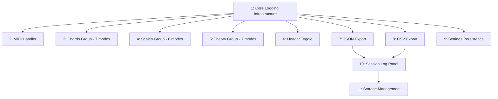

# Issues Review: the-shed-roa

**Date**: 2026-01-17
**Epic**: Session Logging: Capture and Export Detailed Practice Data
**Children**: 11 tasks

## Executive Summary

This breakdown is **reasonably well-structured** with appropriate task boundaries. The 3-way split of mode instrumentation (tasks 3, 4, 5) is the main area of concern - these are structurally identical and could be merged. The overall structure enables good parallelization with 6 tasks that can run in parallel after the foundation is complete. No excessive ceremony detected.

## Structure Analysis

### Task Count Assessment
- **Total tasks**: 11
- **Implementation tasks**: 11 (100%)
- **Review/validation tasks**: 0 (0%)
- **Ceremony overhead**: None - This is lean

### Dependency Graph
- **Longest chain**: 4 tasks (roa.1 -> roa.7/8 -> roa.10 -> roa.11)
- **Parallelization potential**: ~55% could run in parallel
- **Current structure**: Good branching from foundation



### Granularity Assessment
- **Too granular**: 3 tasks (mode instrumentation split)
- **Appropriate**: 7 tasks
- **Too large**: 0 tasks

## Anti-Patterns Detected

### 1. Structurally Identical Tasks (Mode Instrumentation)

Tasks 3, 4, and 5 are nearly identical in structure and implementation pattern:

| Task | Description | Pattern |
|------|-------------|---------|
| roa.3 | Chords Group (7 modes) | StartGame/NextChallenge/EndRound/EndGame hooks |
| roa.4 | Scales Group (6 modes) | StartGame/NextChallenge/EndRound/EndGame hooks |
| roa.5 | Theory Group (7 modes) | StartGame/NextChallenge/EndRound/EndGame hooks |

**Why this is problematic:**
- Same pattern applied identically to each group
- No meaningful difference in approach or skills needed
- The spec itself notes: "Can be done in one pass since pattern is identical"
- Creates artificial handoff points with no benefit

**Tasks affected**: roa.3, roa.4, roa.5
**Impact**: 2 extra task transitions, potential for inconsistent implementation across groups

### 2. Minor: Dual Toggle Persistence

The Header Toggle Button (roa.6) mentions "State persists across page reloads via localStorage" in its acceptance criteria, but Settings Persistence (roa.9) handles the same thing through the existing settings system.

**Tasks affected**: roa.6, roa.9
**Impact**: Minor - could lead to duplicate persistence mechanisms. The header toggle should use the settings system, not its own localStorage.

## Parallelization Opportunities

### Parallel Group 1 (After roa.1 completes)
These can all run simultaneously:
- roa.2: MIDI Handler Instrumentation
- roa.3+4+5: Mode Instrumentation (merged - see recommendation)
- roa.6: Header Toggle Button
- roa.7: JSON Export Function
- roa.8: CSV Export Functions
- roa.9: Settings Persistence

**6 independent work streams** - excellent parallelization potential.

### Sequential Chain (Cannot parallelize)
- roa.10 (Session Log Panel) must wait for roa.7 and roa.8
- roa.11 (Storage Management) must wait for roa.10

This sequential chain is **appropriate** - the panel needs export functions to wire up buttons.

## Simplification Recommendations

### High Priority (Do Now)

#### MERGE: roa.3 + roa.4 + roa.5
**Into**: "Mode Instrumentation: All 20 Modes"
**Rationale**:
- Identical implementation pattern for each mode
- Spec explicitly states "can be done in one pass"
- Grouping by "chord/scales/theory" is arbitrary - it's all the same 4-line instrumentation per mode
- A single task with a checklist of 20 modes is clearer than 3 separate tasks

**Savings**:
- 2 fewer tasks
- 2 fewer handoffs
- Eliminates risk of inconsistent implementation across groups
- Single PR with all modes instrumented

**Implementation**: Add a checklist to the merged task listing all 20 modes to ensure none are missed.

### Medium Priority (Consider)

#### CLARIFY: roa.6 and roa.9 persistence overlap
**Issue**: Both mention localStorage persistence for the toggle state
**Recommendation**:
- roa.6 should create the toggle UI and call `saveAllSettings()` on toggle
- roa.9 adds the field to save/load functions
- Make roa.6 explicitly depend on roa.9, OR merge them

**Rationale**: The header toggle (roa.6) should not implement its own persistence - it should use the settings system (roa.9). Currently they could create competing implementations.

**Suggested fix**: Add roa.9 as a dependency of roa.6, or note in roa.6 that it calls the settings system (to be implemented in roa.9).

## Scoring

| Dimension | Score | Notes |
|-----------|-------|-------|
| Task Count Proportionality | 75/100 | 11 tasks for 9 work items - mode split is unnecessary |
| Dependency Efficiency | 85/100 | Good parallel structure, minimal unnecessary sequencing |
| Ceremony Overhead | 100/100 | Zero review/validation tasks - pure implementation |
| Granularity Appropriateness | 70/100 | Mode instrumentation split is too granular |
| Structural Clarity | 90/100 | Clear dependencies, well-documented tasks |

**Overall Score**: 82/100 - Well-structured with minor improvements possible

## Recommended Actions

1. **Merge mode instrumentation tasks**:
   ```bash
   # Create merged task
   bd add --parent the-shed-roa --title "Mode Instrumentation: All 20 Modes" --depends-on the-shed-roa.1

   # Close the split tasks with note
   bd close the-shed-roa.3 --comment "Merged into consolidated mode instrumentation task"
   bd close the-shed-roa.4 --comment "Merged into consolidated mode instrumentation task"
   bd close the-shed-roa.5 --comment "Merged into consolidated mode instrumentation task"
   ```

2. **Clarify toggle persistence**: Add note to roa.6 that it should call `saveAllSettings()` rather than implementing its own localStorage logic.

3. **Keep everything else as-is**: The remaining task boundaries are appropriate and well-scoped.

## Alternative Structure

If starting fresh with 9 tasks (matching the 9 work items in the spec):

| Task | Description | Dependencies |
|------|-------------|--------------|
| 1 | Core Logging Infrastructure | - |
| 2 | MIDI Handler Instrumentation | 1 |
| 3 | Mode Instrumentation (all 20 modes) | 1 |
| 4 | Header Toggle Button | 1, 9 |
| 5 | Session Log Panel | 1, 6, 7 |
| 6 | JSON Export Function | 1 |
| 7 | CSV Export Functions | 1 |
| 8 | Storage Management | 5 |
| 9 | Settings Persistence | 1 |

This reduces task count from 11 to 9 while maintaining the same parallel execution potential and eliminating the artificial mode group boundaries.
